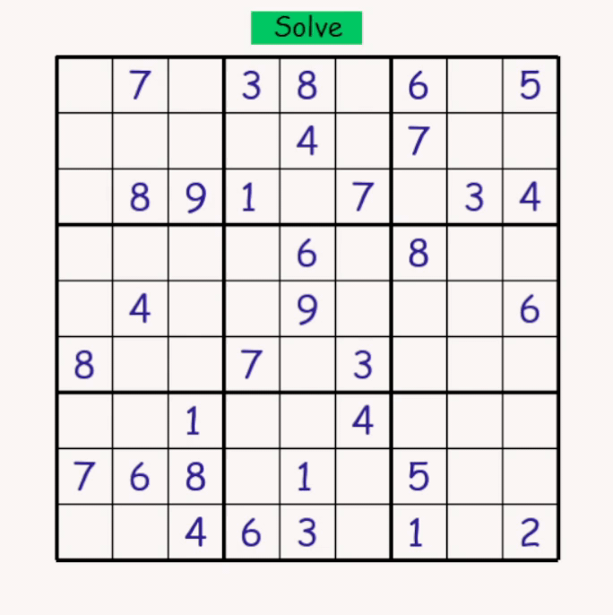

# Sudoku player / solver

This is a [sudoku](https://sudoku.com/) player and solver made using the [pygame](https://www.pygame.org/) library

The sudoku is provided by an api by [Sugoku]("https://sugoku.herokuapp.com/")

# How to install
To clone this repository: 
```
git clone https://github.com/Devansh-ops/python-gui-sudoku.git
```
To install requirements (pygame):
```
pip install -r requirements.txt
```

# How to run
```
python sudoku.py
```

# How to play
1. To edit a tile, click on the tile, and press any number from `1-9`
2. To remove a number from a tile, click on the tile, and press `0`
3. To auto-solve the sudoku, press on the `Solve` button
---
## Possible Future Features:
- Time yourself solving the sudoku
- reset button to generate another sudoku
---
<div align="center">

</div>
<br>

Inspired by [PiyushG14](https://github.com/PiyushG14/Pygame-sudoku)